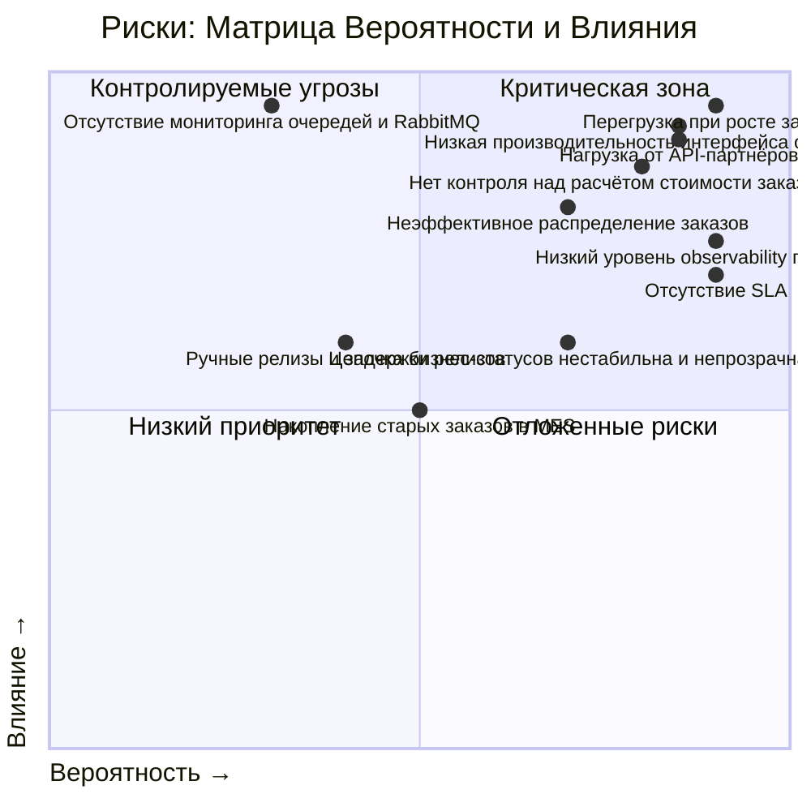

# Проблемные места в архитектуре "Александрита"

Ниже представлены **текущие проблемы** и **потенциальные уязвимости**, которые были сформированы исходя из:

* архитектуры и C4-схемы,
* технологического стека,
* бизнес-процессов,
* жалоб пользователей и сотрудников.

---

## 1. Низкая производительность интерфейса оператора MES

* **Описание**: страница со списком заказов загружается долго, несмотря на фильтрацию и пагинацию.
* **Техническая причина**: возможно, отсутствуют индексы на нужные поля в БД MES, или используется неэффективный SQL-запрос.
* **Бизнес-последствие**: операторы теряют время и мотивацию, заказы не берутся в работу своевременно.

---

## 2. Перегрузка при росте заказов

* **Описание**: каждое приложение и каждая база работает в одном экземпляре.
* **Техническая причина**: отсутствие масштабирования, возможно по финансовым или организационным причинам.
* **Бизнес-последствие**: при росте нагрузки система теряет производительность, высокие риски отказа.

---

## 3. Нет контроля над расчётом стоимости заказа (MES)

* **Описание**: расчёт стоимости может занимать от 2 до 30 минут.
* **Техническая причина**: синхронное выполнение тяжёлых вычислений, отсутствие очереди или прогресса.
* **Бизнес-последствие**: заказ "зависает" между шагами, пользователь не понимает, идёт ли обработка.

---

## 4. Неэффективное распределение заказов

* **Описание**: операторы вручную выбирают заказы, нет приоритезации.
* **Техническая причина**: отсутствует бизнес-логика автоназначения на стороне MES API.
* **Бизнес-последствие**: важные или срочные заказы не попадают в работу вовремя.

---

## 5. Нагрузка от API-партнёров

* **Описание**: после открытия API появились массовые жалобы на неисполнение заказов.
* **Техническая причина**: MES/CRM не масштабированы под рост входящих заказов, нет ограничений или очередей для новых клиентов.
* **Бизнес-последствие**: снижение доверия партнёров, репутационные риски.

---

## 6. Отсутствие мониторинга очередей и RabbitMQ

* **Описание**: сообщения о заказах между CRM, MES и API передаются через очередь, но задержки не диагностируются.
* **Техническая причина**: RabbitMQ работает без метрик, нет dead-letter queue, нет масштабируемых consumer-ов.
* **Бизнес-последствие**: сообщения могут "зависать" и приводить к невидимым ошибкам в цепочке.

---

## 7. Цепочка бизнес-статусов нестабильна и непрозрачна

* **Описание**: переходы между статусами происходят в разных системах, а связь между ними основана на очередях.
* **Техническая причина**: нет единого трекера статуса заказа, ошибки в одной системе не видны в другой.
* **Бизнес-последствие**: менеджеры не могут быстро понять, на каком этапе заказ, и клиенты жалуются.

---

## 8. Ручные релизы и задержки релизов

* **Описание**: релизы откладываются из-за ручных E2E-тестов и багов.
* **Техническая причина**: нет автоматизированной регрессии, нет стабильной QA-инфраструктуры.
* **Бизнес-последствие**: замедление внедрения улучшений и фиксов, технический долг накапливается.

---

## 9. Накопление старых заказов в MES

* **Описание**: заказы отображаются на дашборде, даже если они давно завершены.
* **Техническая причина**: нет архивации или логического удаления завершённых заказов.
* **Бизнес-последствие**: замедление работы системы, потеря фокуса на новых заказах.

---

## 10. Отсутствие SLA

* **Описание**: нет чётких ограничений по времени ответа на расчёт стоимости, ожидание API, обработку заказов.
* **Техническая причина**: отсутствие SLA-ориентированной архитектуры.
* **Бизнес-последствие**: пользователи не получают обратную связь, нет контроля за качеством сервиса.

---

## 11. Низкий уровень observability платформы

* **Описание**: нет наличия APM-метрик, логов, дашбордов, алертинга. Возможна слепота к внутренним сбоям.
* **Техническая причина**: отсутствие observability-ориентированной архитектуры.
* **Бизнес-последствие**: разработчики тратят больше времени на поиски и устранение проблем, первыми о багах узнают конечные пользователи платформы, что снижает удовлетворенность от работы платформы.

---

# Список инициатив для устранения проблем

## 1. Улучшение производительности MES (операторский дашборд)
### 1.1. Оптимизация SQL-запросов и добавление необходимых индексов.
**Цель**: Ускорить загрузку списка заказов по статусам.  
### 1.2. Реализация асинхронной подгрузки заказов (lazy loading) на фронте MES.
**Цель**: Уменьшить объём данных, который загружается за раз.
### 1.3. Архивация старых заказов в отдельную таблицу или хранилище.
**Цель**: Уменьшить нагрузку на основную таблицу заказов, исключить завершённые заказы из основного потока.

---

## 2. Масштабирование и отказоустойчивость
### 2.1. Горизонтальное масштабирование ключевых компонентов (MES API, CRM API, Shop API).
**Цель**: Обработка большего количества заказов и API-запросов.
### 2.2. Внедрение балансировщика нагрузки и масштабируемых consumer-ов RabbitMQ.
**Цель**: Стабильная обработка сообщений при росте трафика.
### 2.3 Перевод RabbitMQ на отказоустойчивую конфигурацию с мониторингом и dead-letter queue.
**Цель**: Обнаружение и предотвращение зависших сообщений.

---

## 3. Управление расчётом стоимости и прозрачность статусов
### 3.1. Перевод расчёта стоимости в MES в асинхронный режим с отображением прогресса.
**Цель**: Уменьшить неопределённость и негатив со стороны пользователя.
### 3.2. Внедрение очереди задач на расчёт стоимости (например, внутри MES или отдельным сервисом).
**Цель**: Обеспечение контроля за тем, какие заказы считаются, с возможностью приоритизации.

---

## 4. Обработка API-заказов от сторонних продавцов
### 4.1. Ограничение входящего API-трафика (rate limiting, quotas) по клиентам.
**Цель**: Предотвратить DDOS от неумышленной массовой отправки заказов.
### 4.2. Введение очереди на создание заказов из API с приоритезацией и метриками.
**Цель**: Контроль входящего потока заказов, отслеживание задержек.
### 4.3. SLA и статус-трекинг для партнёров через API (например, webhook или pull-статусы).
**Цель**: Уменьшить количество обращений и жалоб от внешних клиентов.

---

## 5. Улучшение процессов разработки и выпуска
### 5.1. Внедрение автотестов E2E и регрессии.
**Цель**: Уменьшить количество ручного тестирования и ускорить релизы.
### 5.2. Внедрение Canary- или Blue-Green релизов.
**Цель**: Безопасное внедрение версий с контролем влияния на пользователей.

---

## 6. Распределение заказов среди операторов
### 6.1. Внедрение автоназначения заказов операторам по загруженности и приоритету.
* **Цель**: Ускорить начало производства, избежать "ручного выбора".

---

## 7. Внедрение observability на платформу
### 7.1. Внедрение мониторинга, трейсинга, логирования на ключевых точках системы
**Цель**: Уменьшить время поиска причин багов и дать разработчикам больше инфомрации о причинах инцидентов

---

# Целевая архитектура через 6 месяцев

* MES и CRM масштабируются по горизонтали и не тормозят при росте заказов.
* Расчёт стоимости вынесен в отдельный сервис-воркер, время выполнения отлеживается и управляется.
* Новые заказы автоматически распределяются между доступными операторами.
* RabbitMQ масштабирован и мониторится, потерь сообщений нет.
* Заказы обрабатываются в рамках SLA, пользователи получают статус заказа в реальном времени (в том числе API-партнёры).
* Релизы выходят каждые 2 недели без задержек, тесты автоматизированы.

---

# Если можно выбрать только три пункта на ближайшие пол года

Я бы предпочел сделать анализ на основе системы сбалансированных показателей (Balanced Scorecard, BSC) компании, если таковая имеется. Но предположим что ее нет.
Тогда я бы сделал матрицу вероятности/влияния рисков и добавил в нее проблемы и уязвимости, которые выделили ранее в задании и оценил бы их с командой.

---

## Матрица Вероятности и Влияния

Примерная таблица оценки:

| Оценка   | Вероятность (P)                                                           | Влияние (I)                                                                     |
|----------|---------------------------------------------------------------------------|---------------------------------------------------------------------------------|
| 0.9–1.0  | **Почти наверняка**: уже происходит или происходит регулярно              | **Критическое влияние**: срыв сроков, потери клиентов, падение системы          |
| 0.7–0.89 | **Очень вероятно**: наблюдаются ранние проявления или системно появляется | **Высокое влияние**: влияет на репутацию, увеличивает издержки, вызывает жалобы |
| 0.4–0.69 | **Возможно**: может произойти при определённых условиях                   | **Среднее влияние**: снижает производительность, но не останавливает бизнес     |
| 0.1–0.39 | **Маловероятно**: требует специфических условий                           | **Низкое влияние**: вредит удобству, но не критичен                             |
| 0.0–0.1  | **Практически исключено**                                                 | **Незначительное влияние**                                                      |
 

---

Следовательно, самые острые проблемы находятся в правом верхнем углу в квадранте Q1.

---

## ТОП-3 инициативы на ближайшие 6 месяцев
1. **Оптимизация MES db (индексы + запросы)**  
   Быстрый эффект, высокая боль у операторов, минимальные ресурсы на реализацию.

2. **Очередь на расчёт стоимости в MES + асинхронный расчёт с прогрессом**  
   Так же узкое горлышко в системе, влияет на всех пользователей (как B2C, так и B2B).

3. **Rate limiting и буферизация входящих API-заказов**  
   Прямое решение проблемы перегрузки, с минимальной реализацией даёт большой выигрыш.

И под звездочкой 4й пункт - **Масштабирование и отказоустойчивость**, т.к. этот пункт так же очень критичен, но его релазиация может занять много времени.
