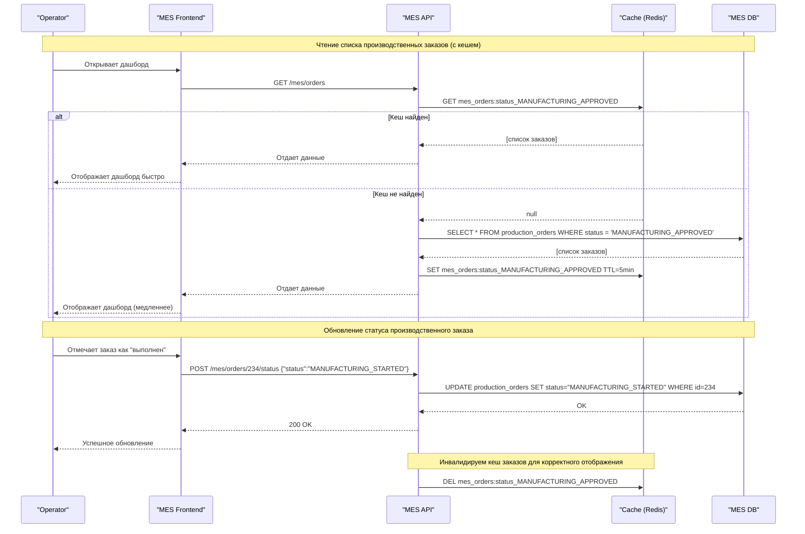

# Кеширование

## Мотивация

Система MES испытывает серьёзные проблемы с производительностью:

* **Операторы жалуются на долгую загрузку дашборда**. Это напрямую влияет на мотивацию операторов и скорость запуска заказов в производство.
* **Клиенты (включая сторонние компании через API) жалуются на длительное ожидание заказа**, несмотря на то что производственные мощности не загружены. Это указывает на задержки, не связанные с реальным производством, а с прохождением заказа по системе.
* **Расчёт стоимости модели в MES занимает от 2 до 30 минут.** Это сильно замедляет прохождение заказов к следующему этапу.

Необходимо внедрить кеширование, чтобы:

* Уменьшить время отклика интерфейса MES для операторов.
* Снизить нагрузку на сервер MES при повторных запросах одних и тех же данных.
* Сократить время, необходимое для получения расчётной стоимости в повторяющихся или дублирующихся случаях.
* Повысить масштабируемость MES и CRM в условиях продолжающегося роста заказов.

**Элементы системы, которые будут включены в кеширование:**

1. **Дашборд заказов MES:** список заказов в статусах, которые наиболее интересны операторам.
2. **Результаты расчёта стоимости изделий:** при повторной отправке идентичной модели.
3. **Метаданные моделей:** размеры, количество полигонов и другие характеристики, необходимые для предварительных проверок и UI-рендеринга.
4. **Фильтры и поисковые запросы к заказам.**

---

## Предлагаемое решение

### Серверное кеширование

**Почему серверное?**

* Кешируемые данные важны для разных пользователей и должны быть доступны независимо от клиента (браузер, API, внутренний интерфейс).
* MES — централизованное приложение, и большая часть нагрузки — это именно серверная обработка.
* Расчёт стоимости и загрузка списка заказов — тяжёлые операции, неэффективные для реализации в клиентском кеше.

---

### Подходы к кешированию

#### Кеширование дашборда заказов операторов MES

**Паттерн:** **Cache-Aside**

**Как работает:**

* При первом запросе данные о заказах извлекаются из БД, помещаются в кеш (например, Redis), и отправляются пользователю.
* Повторные запросы (особенно популярные фильтры: новые, "в работе") обслуживаются из кеша.
* При изменении статуса заказа система очищает/обновляет соответствующие записи в кеше.

**Почему не Write-Through или Refresh-Ahead:**

* Write-Through может перегрузить кеш при большом количестве новых или обновляемых заказов.
* Refresh-Ahead неэффективен, т.к. нельзя предсказать, какие фильтры или статусы интересуют операторов в конкретный момент.

#### Кеширование расчёта стоимости 3D-моделей

**Паттерн:** **Write-Through + TTL**

**Как работает:**

* При новом расчёте стоимости модель и результат сохраняются в кеш (ключ — хеш модели или комбинация хеш + метаданные).
* При повторном запросе на расчёт проверяется наличие результата в кеше — если есть, сразу возвращается.
* Устанавливается TTL (например, 7 дней) на такие записи, чтобы не хранить устаревшие или уже обработанные заказы.

**Почему не Cache-Aside:**

* Потенциально опасно отдавать "устаревшую" стоимость в случае изменений в производстве или прайсинге.
* Write-Through с TTL позволяет более строго контролировать актуальность данных.

#### Метаданные моделей (полигональность, вес, объём)

**Паттерн:** **Cache-Aside**

**Как работает:**

* Когда клиент загружает или создает 3D-модель, вычисленные характеристики кэшируются.
* Это сокращает время первичной проверки и помогает быстрее фильтровать неподходящие модели.

---

### Диаграмма последовательности действий (Sequence diagram) для операции чтения списка заказов и записи об изменении статуса заказа

Чтобы ускорить работу интерфейса MES, мы применим кеширование чтения (Cache-Aside) только для операций выборки. Статусы будем писать напрямую в БД и инвалидировать кеш по необходимости.

### Сравнительный анализ стратегий инвалидации кеша

| № | Стратегия инвалидации       | Преимущества                                             | Недостатки                                                                  | Подходит ли для MES? | Комментарий                                                                                          |
|---|-----------------------------|----------------------------------------------------------|-----------------------------------------------------------------------------|----------------------|------------------------------------------------------------------------------------------------------|
| 1 | **Временная (TTL)**         | Простота реализации, не требует отслеживания изменений   | Возможна "устаревшая" информация, задержка между обновлением и инвалидацией | ⚠️ Частично          | Хорошо работает при стабильных данных. В MES может привести к неактуальному статусу заказа.          |
| 2 | **На основе запроса**       | Обновление кеша сразу при любом изменении                | Требует глубоких хуков в коде бизнес-логики                                 | ✅ Подходит           | Хороший вариант при контроле над изменениями — заказ изменился → кеш удалили.                        |
| 3 | **На основе изменений**     | Актуальные данные, особенно при event-driven архитектуре | Необходимость отслеживать все источники изменений                           | ⚠️ Частично          | Работает хорошо, если есть централизованная шина событий (что не так в MES).                         |
| 4 | **Программная инвалидация** | Гибкость — можно построить любые правила                 | Повышает сложность, легко допустить ошибку                                  | ✅ Подходит           | Позволяет, например, удалять кеш только если заказ перешел в "завершен", но не при любом обновлении. |
| 5 | **По ключу**                | Точная, минимальное влияние на остальной кеш             | Требует строгой структуры ключей                                            | ✅ Подходит           | Мы знаем ID заказа или статус — можно инвалидировать при апдейте.                                    |

---

#### Рекомендуемая стратегия

Для MES-сценария логично использовать сочетание двух стратегий:

1. **Инвалидация по ключу** — точечное удаление кеша при обновлении заказов, например:

    * `DEL mes_orders:status_MANUFACTURING_APPROVED` после изменения статуса заказа.

2. **Программная инвалидация** — более гибкий подход, если, например:

    * Нужно гибко сбрасывать кеш в нужный момент и по нужному условию

---
